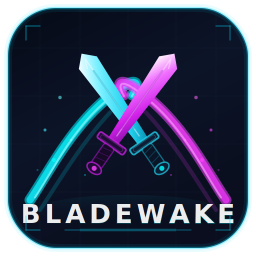

# Bladewake - Early Access Test Builds

**Fast-paced, neon-soaked sword arena combat.**
Public testing channel for pre-release Windows builds.

---

## ⚡ Download

Grab the latest zipped build from the **[Releases page](https://github.com/tonywied17/bladewake-demo/releases/latest)**.

1. Download `Bladewake-EarlyAccess-vX.Y.Z-win64.zip`
2. Extract anywhere (e.g. `C:\Games\Bladewake`)
3. Run `Bladewake.exe`

> **Windows 10/11 64-bit only.** Builds are unsigned - SmartScreen may warn the first time. Click **More info → Run anyway**.

## 🎮 What is Bladewake?

A **2.5D sidescrolling platform fighter** (think Smash-style — 3D characters, 2D plane of play) built in Godot 4.6, focused on:

- **Trail-based blade combat** - every swing leaves a wake that reads as both flourish and threat range
- **Skill-floor friendly, ceiling-deep** - light/heavy/parry/dash, no combo trees to memorize
- **Built for short sessions** - matches resolve in minutes, not hours
- **Online + local play** - Nakama-backed matchmaking, plus practice arenas

This is an **early access tester drop**. Expect rough edges; bring opinions.

## 🧪 What to Test

The current build is focused on **core combat feel** and **arena flow**. Please poke at:

### Combat
- [ ] Light attack chaining and recovery windows
- [ ] Heavy attack commitment / cancel rules
- [ ] Parry timing and reward
- [ ] Dash i-frames and stamina cost
- [ ] Hit registration at angle / fast crossing
- [ ] Trail visuals at high refresh rates (144Hz+)

### Movement & Camera
- [ ] Dash / jump / double-jump feel
- [ ] Ledge / platform traversal
- [ ] Camera framing on 1v1 vs free-for-all
- [ ] Camera shake intensity

### Arenas
- [ ] Each arena layout - platform spacing, ring-out zones, hazards
- [ ] Pickup spawns / items
- [ ] Visual readability in fights

### UI / UX
- [ ] Main menu nav (mouse + controller)
- [ ] Settings persistence between launches
- [ ] HUD readability mid-fight
- [ ] Pause / resume

### Performance
- [ ] FPS at 1080p / 1440p / 4K
- [ ] Stutters on first arena load
- [ ] Memory footprint after 30+ min sessions

### Online (if enabled in build)
- [ ] Matchmaking time
- [ ] Latency / desync during clashes
- [ ] Disconnect recovery

## 🐛 Reporting Bugs / Suggesting Features

Use the **[New Issue](https://github.com/tonywied17/bladewake-demo/issues/new/choose)** button - there are templates for:

- 🐛 **Bug Report** - crashes, broken mechanics, visual glitches
- 💡 **Feature Request / Feedback** - design ideas, balance thoughts, polish notes
- ⚡ **Performance Issue** - frame drops, hitches, GPU/CPU spikes

Always include:
- Build version (shown in main menu corner or `version.txt` in zip)
- OS + GPU + RAM
- Steps to reproduce (for bugs)
- Short clip / screenshot if visual

## 🔒 Known Limitations

- No save game / progression carry-over between builds yet
- Some placeholder audio and VFX
- Controller rebinding is partial
- Linux / macOS builds not yet published here

## 📜 License & Distribution

These builds are provided **for testing purposes only**. Do not redistribute, mirror, or repackage without permission. Game code, art, and audio are © Tony Wiedman; all rights reserved during early access.

## 🔗 Links

- **Main project & source** - _(private during early access)_
- **Discord / community** - coming soon
- **Dev updates** - follow [@tonywied17](https://github.com/tonywied17)

---

Built with Godot 4.6 · Networked with Nakama · Made with too much caffeine

